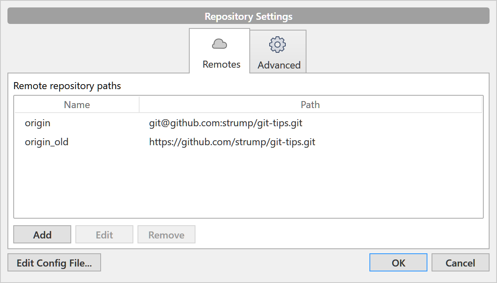
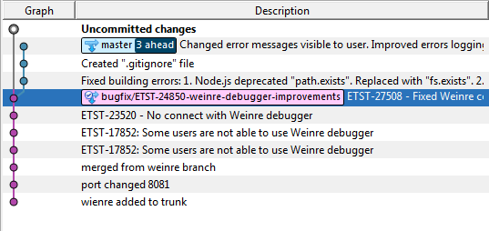

## Intro
Working with git through the console (in the case of Windows via git bash terminal) has at least 2 benefits:

* You have complete control over what you are doing and for what files.
* Usually, there is `.bash_history` file, where you can see which commands sequence has led to the problem. This knowledge makes much easier to find root cause of possible problems.

GUI clients have advantages in viewing branches, commit history, merge conflicts, syntax highlight and IDE integration (less focus switches). But knowing GIT CLI will make you true hardcore developer who can solve any problem and even more - never create those problems.

## Table of content

* [Question: How to clone repository by HTTPS URL if GIT rejects SSL certificate](#question-how-to-clone-repository-by-https-url-if-git-rejects-ssl-certificate)
* [Question: How to setup SSH access for GIT?](#question-how-to-setup-ssh-access-for-git)
* [Question: What should I do with SSH keys?](#question-what-should-i-do-with-ssh-keys)
* [Question: I've set up SSH, but when I try to pull from remote repository I get an error: "PuTTY Fatal Error", Disconnected: No supported authentication methods available (server sent: publickey)](#question-ive-set-up-ssh-but-when-i-try-to-pull-from-remote-repository-i-get-an-error-putty-fatal-error-disconnected-no-supported-authentication-methods-available-server-sent-publickey)
* [Question: How could I check if my SSH connection is set up right?](#question-how-could-i-check-if-my-ssh-connection-is-set-up-right)
* [Question: I get error "UNPROTECTED PRIVATE KEY FILE!"](#question-i-get-error-unprotected-private-key-file)
* [Question: I've got error "Filename too long" in git for windows. What should I do?](#question-ive-got-error-filename-too-long-in-git-for-windows-what-should-i-do)
* [Question: What should I do in case of GIT conflicts during branch merge?](#question-what-should-i-do-in-case-of-git-conflicts-during-branch-merge)
* [Question: After checkout master I resolved conflicts by hand. But when I try to merge GIT says that I still have conflicted files. What should I do?](#question-after-checkout-master-i-resolved-conflicts-by-hand-but-when-i-try-to-merge-git-says-that-i-still-have-conflicted-files-what-should-i-do)
* [Question: What should I do when I see Nano editor?](#question-what-should-i-do-when-i-see-nano-editor)
* [Question: What is `stage` in terms of GIT?](#question-what-is-stage-in-terms-of-git)
* [Question: Which GIT client to use?](#question-which-git-client-to-use)
* [Question: How to cancel my commit from last friday?](#question-how-to-cancel-my-commit-from-last-friday)
* [Question: I've accidentally commited to the master branch. How to move commits to a branch?](#question-ive-accidentally-commited-to-the-master-branch-how-to-move-commits-to-a-branch)
* [Question: How to revert MERGE commit? (when it's already in public repo)](#question-how-to-revert-merge-commit-when-its-already-in-public-repo)
* [Question: How to revert one or two files without reverting entire commit?](#question-how-to-revert-one-or-two-files-without-reverting-entire-commit)
* [Question: How to undo "git reset --hard" for local commits?](#question-how-to-undo-git-reset---hard-for-local-commits)
* [Question: How to find TEXT inside commits history (search in code, instead of commit messages) within dates range?](#question-how-to-find-text-inside-commits-history-search-in-code-instead-of-commit-messages-within-dates-range)
* [Question: How to use Keybase client to sign commits with PGP keys?](#question-how-to-use-keybase-client-to-sign-commits-with-pgp-keys)

## Question: How to clone repository by HTTPS URL if GIT rejects SSL certificate

**Answer 1:** Create environment variable `GIT_SSL_NO_VERIFY=true`:

```shell
$> export GIT_SSL_NO_VERIFY=true
$> git clone <url>
$> export GIT_SSL_NO_VERIFY=false
```

**Answer 2:** If repository is already cloned then go to the working copy folder and execute command:

```shell
$> git config http.sslVerify false
```

This command will disable SSL certificate checks for entire local copy.

**Answer 3:** Edit global GIT configuration file ~/.git/config

```ini
[http "https://example.com"]
    sslVerify = false
```

These lines disable SSL certificate check for site https://example.com

## Question: How to setup SSH access for GIT?

**Answer:** You need ssh2_rsa keys (pair of public and private keys). Public key you add to your Stash/Bitbucket/Github account and private key store at your computer and don't give to anyone.

**For linux users:**

```shell
$> ssh-keygen
```

If you wish you may create passfrase (almost as a password which you will enter each time GIT is accessing key (often disturbs)), otherwise press `Enter` and skip this step. Next:

```shell
$> cat ~/.ssh/id_rsa.pub
```

Copy output of this command (e.g. `ssh-rsa AAAAB3NzaC1yc2...EAID3Q== obe.wan@tatooine.com`) and paste to profile Stash > Manage account > SSH Keys > Add key. For Github open Settings > SSH and GPG keys > New SSH key.

**For Windows users:**

`ssh-keygen` tool is a part of [Git for Windows](https://gitforwindows.org) toolchain.

1. Run command

```shell
$> ssh-keygen -f <username>_git.ppk -C "<email@domain.com>"
```

2. You will get two files: `<username>_git.ppk` and `<username>_git.ppk.pub`.

3. Content of `<username>_git.ppk.pub` (your public key) copy and paste through SSH keys management interface of Stash/Bitbucket/Github.

**For Windows users 2 (puttygen):**

0. Download [Puttygen](https://www.chiark.greenend.org.uk/~sgtatham/putty/latest.html)

1. Run Puttygen and press Generate:


2. Enter your email to "Key comment" field

3. Copy long text from the field "Public key for ..." and paste through SSH keys management interface.


4. Save private key on your computer with menu item Conversions > Export OpenSSH Key.

## Question: What should I do with SSH keys?

**Answer:** After you added public SSH key to your GIT server you only need to setup it locally.

**For Windows and Linux:**

1. Open ssh settings file (`~/.ssh/config` or `C:\Users\<login>\.ssh\config`)

2. Add lines with full path to previously generated private key:

```
Host github.com
    IdentityFile C:\path\to\private\key\obewan_git.ppk
```

3. If you wish you can switch local GIT repository from HTTPS URL to SSH protocol with command:

```shell
$> git remote set-url origin git@github.com:strump/git-tips.git
```

**For SourceTree client:**

1. Select menu item Tools > Add SSH Key… and select private key file.

2. Select menu Repository > Repository settings

3. In opened dialog select "origin" and press "Edit"



4. Change URL to: `git@github.com:strump/git-tips.git`


## Question: I've set up SSH, but when I try to pull from remote repository I get an error: "PuTTY Fatal Error", Disconnected: No supported authentication methods available (server sent: publickey)

**Answer 1:** You need to change environment variable `GIT_SSH`, to point to the `ssh.exe` tool

```shell
$> SET GIT_SSH=D:\Git\bin\ssh.exe
```

**Answer 2:** You could try to setup PuttyLink and PuttyAgent tools to manage SSH keys. TortoiseGIT allows to link SSH keys to a remote repository URL. Look in your GIT client repository settings.

## Question: How could I check if my SSH connection is set up right?

**Answer:** Run command

```shell
$> ssh -T -v git@github.com
```

SSH will try to connect github.com. In case of correct private-public keys settings you will see output which ends with:

```
debug1: Authentication succeeded (publickey).
Authenticated to github.com ([140.82.118.4]:22).
debug1: channel 0: new [client-session]
debug1: Entering interactive session.
debug1: pledge: network
debug1: client_input_channel_req: channel 0 rtype exit-status reply 0
Hi <username>! You've successfully authenticated, but GitHub does not provide shell access.
```

## Question: I get error "UNPROTECTED PRIVATE KEY FILE!"

When you try to connection with SSH private key you can see error:

```
debug1: Trying private key: <path/to/private/key>
@@@@@@@@@@@@@@@@@@@@@@@@@@@@@@@@@@@@@@@@@@@@@@@@@@@@@@@@@@@
@         WARNING: UNPROTECTED PRIVATE KEY FILE!          @
@@@@@@@@@@@@@@@@@@@@@@@@@@@@@@@@@@@@@@@@@@@@@@@@@@@@@@@@@@@
Permissions for '<path/to/private/key>' are too open.
```

**For Linux:** You need to change permission for private key file with command:

```shell
$> chmod 400 <path/to/private/key>
```

**For Windows:** You also need to change permissions but it's harder then on Linux:

1. Open private key file properties, open "Security" tab and press "Advanced" button.

2. Press "Disable inheritance" button and select option "Convert inherited permissions into explicit permissions on this object"


3. Remove "Authenticated users" and "Users" from permissions table

4. Press "Add" select your current user as principal and grant "Full control".

## Question: I've got error "Filename too long" in git for windows. What should I do?

**Answer:** Change GIT settings by running command:

```shell
$> git config --system core.longpaths true
```

## Question: What should I do in case of GIT conflicts during branch merge?

**Answer:** Do the merge!

**Answer to the answer:** You should do next operations:

```shell
git fetch origin branch-from
git checkout master
git merge FETCH_HEAD

## Now it's time to modify files with conflicts

git commit
git push origin HEAD
#other version of this command
git push
#or
git push origin master
```

## Question: After checkout master I resolved conflicts by hand. But when I try to merge GIT says that I still have conflicted files. What should I do?

**Answer:** After you edit conflicted files and removed all merge garbage you should necessarily add modified files to the GIT stage. Otherwise GIT doesn't know if you finished or not.

```shell
$> git add path/to/merged/file
```

## Question: What should I do when I see Nano editor?


**Answer:** Git opened text editor nano and proposes you to enter commit message. To save changes and exit this editor press: Ctrl+o (save), Ctrl+x (quit). And by the way, it's better to write commit message in GIT command explicitly:

```shell
$> git commit -m "Your message here"
```

## Question: What is `stage` in terms of GIT?

**Short answer:** It's internal commit-stack of GIT. It's a list of what is going to be committed next.

## Question: Which GIT client to use?

**Answer:** Using GIT client is preferable. At least for the initial period To understand mechanics. But using GIT console it's easier to break something. GUI clients:

* [SmartGit](https://www.syntevo.com/smartgit/) (Windows, Linux, Mac, Free for noncommercial use) - Git client, written in Java.
* [TortoiseGit](https://tortoisegit.org) (Windows) - For those who familiar with Tortoise SVN. All actions via context menues.
* [Source Tree](https://www.sourcetreeapp.com) (Windows, Mac) - Client from Atlassian company which created Jira, Confluence и Stash.
* [Git Fork](https://git-fork.com) (Windows, Mac) - Free and fast GIT client.
* [GitKraken](https://www.gitkraken.com) (Windows, Mac, Linux) - Free client (has Pro version).

## Question: How to cancel my commit from last friday?

**Answer:** If you haven't done push yet and your commit didn't get to remote repository, then you can do `git reset` to revert local repository at multiple commits back. There are three types of reseting: soft, mixed, hard. See [official documentation](https://git-scm.com/docs/git-reset) for details.

If commit is pushed to the server then you can revert changed from any commit with `git revert` command:

```shell
git revert --no-commit 2c98b7b2a1d399c70308c9cc0640c8ca22b01d5a
```

After this files in your working copy would be changed reversing changes from commit `2c98b7b2a1d399c70308c9cc0640c8ca22b01d5a`. You will only need to commit these changes and push.

## Question: I've accidentally commited to the master branch. How to move commits to a branch?

**Answer:** You can't simply push master branch to the remote server. You need to move it carefully to the branch and do pull-request + merge.

<span style="color:red">**Warning!** local history modification could erase commits information!! Do the backups!</span>

Assume we have next local commits history:


First of all you need to checkout a branch:



Now important part. The [rebase](https://git-scm.com/docs/git-rebase) procedure:

```shell
$> git rebase master
First, rewinding head to replay your work on top of it...
Fast-forwarded bugfix/ETST-24850-weinredebugger-improvements to master.
```

Commits graph should look like (branch and master point to the same commit):


Now checkout the "master" branch.

All you left is to rewind commits so `master` is reverted to it's remote state (before your commits):

```shell
$>git reset --hard 0a830ae8089ec27675b134da3ff4755151be2435
HEAD is now at 0a830ae
ETST-27508 - Fixed Weinre cookies.
```

Commits graph became as good as we expected, all changed are in the branch now:


**Answer 2:** This advice was copied from one technical blog. **Can't guarantee that is works.**

<span style="color:red">**Warning!** local history modification could erase commits information!! Do the backups!</span>

So you have "master" branch checked out locally. Run next commands:

```shell
$> git branch feature-branch
$> git reset HEAD~ --hard
$> git checkout feature-branch
```

This creates a new branch, then rolls back the master branch to where it was before you made changes, and finally checking out your new branch with all your previous changes intact.


## Question: How to revert MERGE commit? (when it's already in public repo)

**Answer:** The main problem is that the merge is already public. So you can't just `git reset --hard <hash>` to remove commit from history.

First of all, let's find what we want to revert and what's desired result state.

```shell
$> git log --graph
```

Output (short):

```
* commit 21c769caabd41eac871be2bf79a9db139e88010a
|\ Merge: aaf89e2 08d70c2
| | Author: Palpatine <palpatine@galacticempire.com>
| | Date: Thu Aug 20 00:17:00 2015 -0700
| |
| | Merge pull request #637 in Death-Star/control-board from feature/DS-30021
| |
| | * commit '08d70c2996580b49c2c904c54b9a6badf3c8ce37':
| | beautify after conflict resolve...
| |
| * commit 08d70c2996580b49c2c904c54b9a6badf3c8ce37
| | Author: Darth Maul <darth.maul@galacticempire.com>
| | Date: Wed Aug 19 22:41:22 2015 +0300
| |
| | beautify after conflict resolve
| |

...few commits below....

* | | commit aaf89e2d16840ade383db8f09f9f93873bed663f
|\ \ \ Merge: b20b571 548ffe4
| |_|/ Author: Darth Maul <darth.maul@galacticempire.com>
|/| | Date: Wed Aug 19 23:39:43 2015 -0700
| | |
| | | Merge pull request #669 in Death-Star/control-board from feature/DS-26878-
| | |
| | | * commit '548ffe417fa714865d481df206627704b8a6d120':
| | | added generation of 'X-back-door' header to proxy
```

Last merge with hash `21c769c` should be reverted.

In commit description we can found information about what revisions were merged.

Merge: **`aaf89e2`** `08d70c2`

Let's find those hashes in log above to understand what exactly we will do.

Next, let's revert:

```shell
$ git revert 21c769c -m 1
```

This command will make commit which will apply negative patch of changes from merge. By this action we save integrity for git history (we do not try to remove the bad merge), but we cancel it.

**Important arguments here is `-m` and its value 1.**

`-m` tells git, that by canceling merge-commit we want to go back for `develop` branch by setting hash number of commit from this branch.

`Merge: aaf89e2 (<- branch 1) 08d70c2 (<- branch 2)`


## Question: How to revert one or two files without reverting entire commit?

**Answer:**

```shell
$> git log --graph --oneline
```

Choose commit hash with required state for file(s).

```shell
$> git checkout <hash> path/to/the/file
```

This command will restore state of file(s) to the state in commit with hash you specified. After that just commit this changes.

## Question: How to undo "git reset --hard" for local commits?

**Answer:** Suppose you've hard-reset some commit, using following command, and then realized it was not stored anywhere but your computer:

```shell
$ git reset HEAD~1 --hard
```

You're able to undo hard reset of local commits (those not pushed to remote repo - otherwise it's quite easy) within the time Garbage Collector waits before removing info about all of your actions (about 2 weeks after resetting). Use the following command to check the log:

```shell
$> git reflog
```

After that you should see the output:

```
7951362 HEAD@{0}:
reset: moving to HEAD~1
09227f7 HEAD@{1}:
commit: The commit you have reset
7951362 HEAD@{2}:
commit: An older commit
```

Find the commit you want back (the second line in the current example). Then run the following command using the commit's id:

```shell
$> git reset --hard 09227f7
```

## Question: How to find TEXT inside commits history (search in code, instead of commit messages) within dates range?

**Answer 1:** Print a list of all commits related to folder or entire project and grep in it

```shell
$> git grep <regexp> $(git rev-list --all -- lib/util) -- lib/util
```

Will search inside commits which relates to specific path in repo – lib/util

`git rev-list --all`

This command gives a list of all commits hashes. Adding `"-- lib /util"` will show only commits which made changes in that path.

`git grep <regexp> <hashes...>`

This command makes grep inside specific commits.

**Note.** This method can fail in old repos with error _"Argument list too long"_.

You can try a workaround:

```shell
$> git rev-list --all | xargs git grep <regexp>
```

**Answer 2:** Try to search commits within dates range:

```shell
$> git log -S'<str>' --since=2009.1.1 --until=2018.1.1 -- lib/util
```

```shell
$ git log -G'<regexp>' --since=2009.1.1 --until=2018.1.1 -- lib/util
```

Adding `-p` argument will print part of the commit diff which contains searched text.

**Answer 3:** Search for simple string in specific set of branches `'remotes/origin/release*'`

```shell
$> git branch -a | grep remotes/origin/release | tr -d \* | sed '/->/d' | xargs git grep 'btn-link'
```

See [git grep](https://git-scm.com/docs/git-grep) official documentation for details.

## Question: How to use [Keybase](https://keybase.io/docs/command_line) client to sign commits with PGP keys?

**Answer:** Keybase CLI could be used to manage PGP keys and attach signatures to commits.

First let's setup keybase. Run `keybase gpg list` and find GPG fingerprint:

```
Keybase Key ID:  01019cd59ad7dc28c285d56d8c221328f7c4397223a221c8c7ac5ccd015ad1bbcd760a
PGP Fingerprint: 315a836d2513e723cf0dbe2bc622e5563cac205d
PGP Identities:
   Sergiy Kozyr <s.kozyr@protonmail.com>
   Sergiy Kozyr <s.trump@gmail.com>
```

In my case fingerprint is `315a836d2513e723cf0dbe2bc622e5563cac205d` or last 8 symbols `3cac205d`.
If there's no GPG keys in Keybase storage you need to create it with `keybase pgp gen` first.

**On Windows**

Create `sign-with-keybase.cmd` file with content:

```cmd
@echo OFF
setlocal enabledelayedexpansion

SET DO_VERIFY=FALSE
for %%x in (%*) do (
   if [%%~x]==[--verify] set DO_VERIFY=TRUE
)

if [%DO_VERIFY%] == [TRUE] (
    @REM keybase pgp verify -d "%6" // Doens't work with 3rd party GPG signatures
    gpg %*
) ELSE (
    keybase pgp sign --detached --key "%2"
)
```

Git will call this CMD with arguments `-bsau 3cac205d`. Signature will be printed to stdout and picked by Git.

**On Linux and MacOS**

Create `sign-with-keybase.sh` file with content:

```bash
echo "[GNUPG:] BEGIN_SIGNING D" >&2
keybase pgp sign --detached --key "$3"
echo "[GNUPG:] SIG_CREATED D" >&2
```

Now it's time to setup GIT.

```shell
$> git config --global gpg.program <full path to sign-with-keybase.cmd or sign-with-keybase.sh>
$> git config --global user.signingkey 3cac205d
$> git config --global commit.gpgsign true
```

With this commands we tell GIT where to find our custom signing script and which key to be used for signing.
You can omit `--global` flag if you want to enable signing only for some repositories.

**Note** Script `sign-with-keybase` supports only signing with Keybase but for verification default `gpg` tool is used. That's why `git log -n 5 --show-signature` will show warning "Can't check signature: No public key".

To fix this warning you need to import public keys from Keybase into gpg manually:

```shell
keybase pgp export | gpg --import
```
