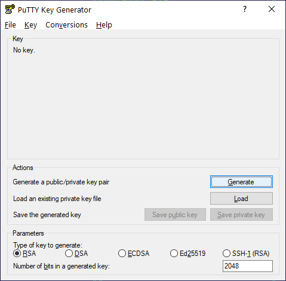
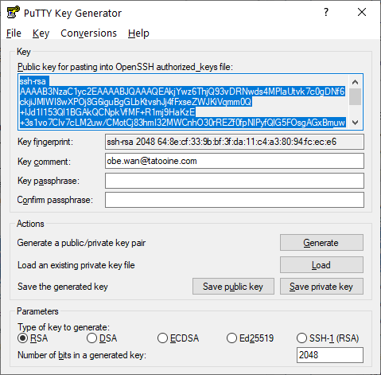
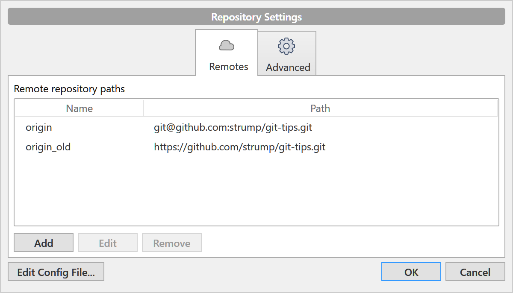
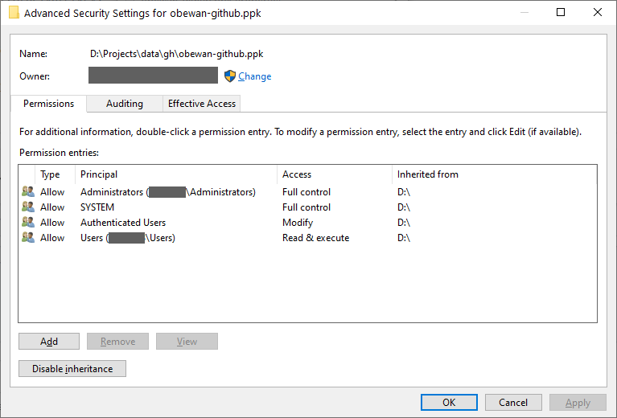
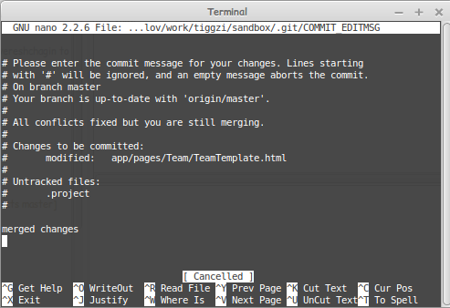
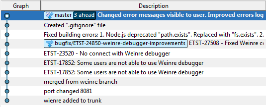
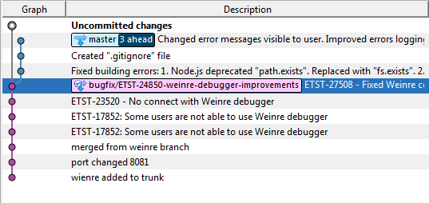
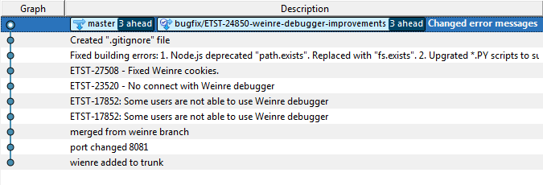
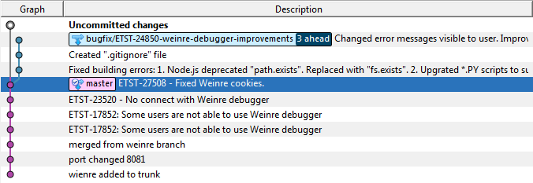

## Введение
Работа с GIT репозитория из консоли (в случае Windows из терминала GIT) имеет как минимум 2 преимущества:

* Вы получаете полный контроль над своими действиями, и к каким именно файлам эти действия применяются
* Обычно GIT создаёт файл `.bash_history` с перечнем всех команд, которые могли привести к проблеме. Эти знания существенно упрощают поиск причин потенциальных проблем.

GUI клиенты имеют преимущества при просмотре веток, истории коммитов, разрешении конфликтов, подстветке синтаксиса и интеграции с IDE (меньше переключений фокуса). Но знание командной строки GIT делает вас настоящим программистом, способным решить любую проблему и даже больше - учит умению не создавать проблем.

## Содержание

* [Вопрос: Как клонировать репозиторий по https-адресу если ругается на SSL сертификат?](#вопрос-как-клонировать-репозиторий-по-https-адресу-если-ругается-на-ssl-сертификат)
* [Вопрос: Как настроить доступ к GIT по SSH?](#вопрос-как-настроить-доступ-к-git-по-ssh)
* [Вопрос: Что делать с SSH ключами?](#что-делать-с-ssh-ключами)
* [Вопрос: Я настроил(а) SSH, но при попытке обновиться появляется окно с сообщением: "PuTTY Fatal Error", Disconnected: No supported authentication methods available (server sent: publickey)](#вопрос-я-настроила-ssh-но-при-попытке-обновиться-появляется-окно-с-сообщением-putty-fatal-error-disconnected-no-supported-authentication-methods-available-server-sent-publickey)
* [Вопрос: Как проверить, правильные ли у меня настройки SSH?](#вопрос-как-проверить-правильные-ли-у-меня-настройки-ssh)
* [Вопрос: Я получаю ошибку "UNPROTECTED PRIVATE KEY FILE!"](#вопрос-я-получаю-ошибку-unprotected-private-key-file)
* [Вопрос: Я получил ошибку "Filename too long" при работе с GIT в Windows. Что мне делать?](#вопрос-я-получил-ошибку-filename-too-long-при-работе-с-git-в-windows-что-мне-делать)
* [Вопрос: Что мне делать, если возник конфликт при слиянии веток?](#вопрос-что-мне-делать-если-возник-конфликт-при-слиянии-веток)
* [Вопрос: Я вручную исправил конфликты, но при попытке мержа жалуется что есть файлы в конфликтном состоянии. И что мне с этим делать?](#вопрос-я-вручную-исправил-конфликты-но-при-попытке-мержа-жалуется-что-есть-файлы-в-конфликтном-состоянии-и-что-мне-с-этим-делать)
* [Вопрос: Что делать, когда GIT показывает мне Nano редактор?](#вопрос-что-делать-когда-git-показывает-мне-nano-редактор)
* [Вопрос: Что такое stage в терминологии git?](#вопрос-что-такое-stage-в-терминологии-git)
* [Вопрос: Каким клиентом пользоваться?](#вопрос-каким-клиентом-пользоваться)
* [Вопрос: Как отменить мой коммит за прошлую пятницу?](#вопрос-как-отменить-мой-коммит-за-прошлую-пятницу)
* [Вопрос: Будучи в состоянии алкогольного опьянения, я закоммитил изменения в master. Как мне переместить эти коммиты в ветку?](#вопрос-будучи-в-состоянии-алкогольного-опьянения-я-закоммитил-изменения-в-master-как-мне-переместить-эти-коммиты-в-ветку)
* [Вопрос: Как отменить неудачный коммит слияния (мерж-коммит)? (когда он уже в публичном репозитарии)](#вопрос-как-отменить-неудачный-коммит-слияния-мерж-коммит-когда-он-уже-в-публичном-репозитарии)
* [Вопрос: Как отменить правки в одном или нескольких файлах не отменяя весь коммит?](#вопрос-как-отменить-правки-в-одном-или-нескольких-файлах-не-отменяя-весь-коммит)
* [Вопрос: Как откатить "git reset --hard" для локальных коммитов?](#вопрос-как-откатить-git-reset---hard-для-локальных-коммитов)
* [Вопрос: Как найти ТЕКСТ в истории коммитов? (внутри кода, а не в сообщениях) в интервале дат?](#вопрос-как-найти-текст-в-истории-коммитов-внутри-кода-а-не-в-сообщениях-в-интервале-дат)
* [Вопрос: Как подписывать коммиты с помощью PGP ключей и приложения Keybase под Windows?](#вопрос-как-подписывать-коммиты-с-помощью-pgp-ключей-и-приложения-keybase-под-windows)

## Вопрос: Как клонировать репозиторий по https-адресу если ругается на SSL сертификат? 

**Ответ 1:** Создать переменную окружения `GIT_SSL_NO_VERIFY=true`:

```shell
$> export GIT_SSL_NO_VERIFY=true
$> git clone <url>
$> export GIT_SSL_NO_VERIFY=false
```

**Ответ 2:** если репозиторий GIT уже выкачан, то перейти в папку с рабочей копией и выполнить:

```shell
$> git config http.sslVerify false
```

Эта команда выключит проверку SSL сертификата для текущего GIT репозитория.

**Ответ 3:** Отредактировать глобальный файл конфигураций ~/.git/config

```ini
[http "https://example.com"]
    sslVerify = false
```

Это выключит проверку SSL сертификата для домена https://example.com

## Вопрос: Как настроить доступ к GIT по SSH?

**Answer:** Вам нужны ssh2_rsa ключи (публичный и приватный ключи). Публичный ключ вы добавляете в свой профиль Github/Stash/Bitbucket, а приватную часть храните у себя и никому не показываете. 

**Для linux пользователей:**

```shell
$> ssh-keygen
```

Дальше соглашаетесь, если хотите можете придумать контрольную фраза (почти пароль, который у вас будут спрашивать при каждом обращении к ключу), иначе жмете `Enter` и пропускаете этот шаг. Дальше:


```shell
$> cat ~/.ssh/id_rsa.pub
```

Копируете вывод команды (например, там будет `ssh-rsa AAAAB3NzaC1yc2...EAID3Q== obe.wan@tatooine.com`) и вставляете в профиль в Stash > Manage account > SSH Keys > Add Key. Для Github откройте Settings > SSH and GPG keys > New SSH key.

**Для Windows:**

Утилита `ssh-keygen` входит в состав [Git for Windows](https://gitforwindows.org).

1. Выполните команду

```shell
$> ssh-keygen -f <username>_git.ppk -C "<email@domain.com>"
```

2. Получите два файла: `<username>_git.ppk` and `<username>_git.ppk.pub`.

3. Содержимое файла `<username>_git.ppk.pub` (это публичный ключ) копируете и вставляете в страницу добавления ключей в Github/Bitbucket/Stash.

**Для Windows, вариент 2 (puttygen):**

0. Скачайте [Puttygen](https://www.chiark.greenend.org.uk/~sgtatham/putty/latest.html)

1. Запустите Puttygen и нажмите Generate:



2. Введите в "Key comment" свой email

3. Скопируйте длинный текст из поля "Public key for ..." и вставьте в страницу добавления ключей в Github/Bitbucket/Stash.



4. Сохраните приватный ключ у себя на компутере через меню Conversions > Export OpenSSH Key.

## Вопрос: Что делать с SSH ключами?

**Ответ:** Если вы добавили публичный SSH ключ через страницу добавления ключей , то остаётся настроить GIT локально.

**Для Windows и Linux:**

1. Откройте файл настроек ssh  (`~/.ssh/config` или `C:\Users\<login>\.ssh\config`)

2. Добавте строку с указанием пути к сгенерированному ранее приватному ключу:

```
Host github.com
    IdentityFile C:\path\to\private\key\obewan_git.ppk
```

3. По желанию, можете перенастроить в git репозитории путь к origin репозиторию командой:

```shell
$> git remote set-url origin git@github.com:strump/git-tips.git
```

**Настройки SourceTree:**

1. Выберите пункт меню Tools > Add SSH Key… и укажите путь к файлу с приватным ключем.

2. Выберите меню Repository > Repository settings

3. В открывшемся диалоговом окне выберите "origin" и нажмите Edit



4. Поменяйте URL на: `git@github.com:strump/git-tips.git`

## Вопрос: Я настроил(а) SSH, но при попытке обновиться появляется окно с сообщением: "PuTTY Fatal Error", Disconnected: No supported authentication methods available (server sent: publickey) 

**Ответ 1:** Вам надо поменять переменную окружения `GIT_SSH`, чтобы она указывала на `ssh.exe`

```shell
$> SET GIT_SSH=D:\Git\bin\ssh.exe
```

**Ответ 2:** Можете настроить PuttyLink и PuttyAgent для управления SSH ключами и использовать их. TortoiseGIT позволяет привязать ключи к адресу GIT сервера. Ищите в настройках к репозиторию у себя локально.

## Вопрос: Как проверить, правильные ли у меня настройки SSH?

**Ответ:** Выполните команду

```shell
$> ssh -T -v git@github.com
```

SSH попытается подключиться к github.com. Если есть соединение с сервером и ключи настроены правильно, то вы увидите на экране текст, заканчивающийся на:

```
debug1: Authentication succeeded (publickey).
Authenticated to github.com ([140.82.118.4]:22).
debug1: channel 0: new [client-session]
debug1: Entering interactive session.
debug1: pledge: network
debug1: client_input_channel_req: channel 0 rtype exit-status reply 0
Hi <username>! You've successfully authenticated, but GitHub does not provide shell access.
```

## Вопрос: Я получаю ошибку "UNPROTECTED PRIVATE KEY FILE!"

При подключении по SSH может появится ошибка:

```
debug1: Trying private key: <path/to/private/key>
@@@@@@@@@@@@@@@@@@@@@@@@@@@@@@@@@@@@@@@@@@@@@@@@@@@@@@@@@@@
@         WARNING: UNPROTECTED PRIVATE KEY FILE!          @
@@@@@@@@@@@@@@@@@@@@@@@@@@@@@@@@@@@@@@@@@@@@@@@@@@@@@@@@@@@
Permissions for '<path/to/private/key>' are too open.
```

**Для Linux:** Вам нужно поменять разрешения для файла с приватным ключем. Выполните команду:

```shell
$> chmod 400 <path/to/private/key>
```

**Для Windows:** Вам тоже надо поменять права для файла с приватным ключем, но это немного сложнее, чем с Linux:

1. Откройте свойства файлы с приватным ключем, Откройте вкладку "Security", нажмите кнопку "Advanced".

2. Нажмите "Disable inheritance" и выберите вариант "Convert inherited permissions into explicit permissions on this object"



3. Удалите строки "Authenticated users" и "Users" из таблицы с разрешениями

4. Нажмите "Add", выберите текущего пользователя и дайте ему права "Full control".

## Вопрос: Я получил ошибку "Filename too long" при работе с GIT в Windows. Что мне делать?

**Ответ:** Нужно поменять глобальные настройки командой:

```shell
$> git config --system core.longpaths true
```
## Вопрос: Что мне делать, если возник конфликт при слиянии веток?

**Ответ:** Нужно сделать ручное слияние!

**Развернутый ответ:** Нужно проделать следующие действия:

```shell
git fetch origin branch-from
git checkout master
git merge FETCH_HEAD
```

Отредактируйте файлы с конфликтами. После этого:

```shell
git commit
git push origin HEAD
#other version of this command
git push
## или
git push origin master
```

## Вопрос: Я вручную исправил конфликты, но при попытке мержа жалуется что есть файлы в конфликтном состоянии. И что мне с этим делать?

**Ответ:** после ручной правки файла, убирания всего мусора мержа, тебе обязательно нужно добавить смерженный файл в stage гита. Иначе GIT не знает, закончил ли ты.

```shell
$> git add path/to/merged/file
```

## Вопрос: Что делать, когда GIT показывает мне Nano редактор?



**Ответ:** GIT открыл текстовый редактор и предлагает ввести сообщения к комиту. Чтобы сохранить изменения и выйти из Nano нажмите: Ctrl+o (сохранить), Ctrl+x (выйти). К стати, лучше писать сообщение во время коммита:

```shell
$> git commit -m "Your message here"
```

## Вопрос: Что такое stage в терминологии git? 

**Короткий ответ:** это внутренний коммит-стек git’а. Это список того, что попадет в следующий коммит.

## Вопрос: Каким клиентом пользоваться?

**Ответ:** Желательно - командной строкой. Как минимум в первое время для понимания механики. Хотя через командную строку гораздо легче накосячить. GUI клиенты:

* [SmartGit](https://www.syntevo.com/smartgit/) (Windows, Linux, Mac, Free for noncommercial use) - Git клиент, написанный на Java.
* [TortoiseGit](https://tortoisegit.org) (Windows) - Для любителей Tortoise SVN. Все действия через контекстные меню.
* [Source Tree](https://www.sourcetreeapp.com) (Windows, Mac) - - клиент от компании Atlassian. Той самой, что продаёт нам Jira, Confluence и Bitbucket.
* [Git Fork](https://git-fork.com) (Windows, Mac) - Бесплатный быстрый GIT клиент.
* [GitKraken](https://www.gitkraken.com) (Windows, Mac, Linux) - Бесплатный (есть Pro версия) клиент.

## Вопрос: Как отменить мой коммит за прошлую пятницу?

**Answer:** Если вы ещё не сделали Push и ваш коммит не попал в удалённый репозиторий, то вы можете сделать `git reset`, чтобы откатить состояние локального репозитория на несколько коммитов назад. Существует три вида reset: soft, mixed, hard. Подробнее читайте в [официальной документации](https://git-scm.com/docs/git-reset), или на [русском](http://habrahabr.ru/post/203282/).

Если же коммит попал на сервер, то можно откатить сделанные в нём изменения с помощью команды `git revert`:

```shell
git revert --no-commit 2c98b7b2a1d399c70308c9cc0640c8ca22b01d5a
```

При этом файлы в рабочей копии будут изменены противоположно тому, как они были изменены в коммите `2c98b7b2a1d399c70308c9cc0640c8ca22b01d5a`. Вам останется только проверить изменения и закоммитить их

## Вопрос: Будучи в состоянии алкогольного опьянения, я закоммитил изменения в master. Как мне переместить эти коммиты в ветку?

**Ответ:** Коммиты в master ветку нельзя просто так запушить на удалённый сервер. Их нужно перенести в ветку и через pull-request + review смержить в master/develop ветку.

<span style="color:red">**Осторожно!!!** изменения локальной истории коммитов может привести к безвозвратной потере данных!! Сделайте резервную копию!</span>

Предположим, что граф коммитов выглядит вот так::



Для начала нужно сделать checkout для ветки `bugfix/ETST-24850-weinre-debugger-improvements`:



Теперь важный момент, вам нужно сделать [rebase](https://git-scm.com/docs/git-rebase):

```shell
$> git rebase master
First, rewinding head to replay your work on top of it...
Fast-forwarded bugfix/ETST-24850-weinredebugger-improvements to master.
```

История коммитов становится следующей (ветка и master теперь указывают на один коммит):



Теперь переключитесь на `master` ветку.

Осталось откатить `master` до начального состояния, когда вы ещё не сделали эти позорные коммиты:

```shell
$>git reset --hard 0a830ae8089ec27675b134da3ff4755151be2435
HEAD is now at 0a830ae
ETST-27508 - Fixed Weinre cookies.
```

Граф коммитов стал таким, как нужно, коммиты из master перешли в ветку:



**Ответ 2:** Следующий совет взят из одного технического блога. **Работоспособность метода не проверялась на реальном проекте.**

<span style="color:red">**Осторожно!!!** изменения локальной истории коммитов может привести к безвозвратной потере данных!! Сделайте резервную копию!</span>

Значит вы находитесь в локальной "master" ветке. Выполните команды:

```shell
$> git branch feature-branch
$> git reset HEAD~ --hard
$> git checkout feature-branch
```

С помощью этих команд создаётся новая ветка, текущая ветка откатывается до состояния удалённого репозитория, ветка `feature-branch` становится активной.

## Вопрос: Как отменить неудачный коммит слияния (мерж-коммит)? (когда он уже в публичном репозитарии)

**Ответ:** Главная проблема в том, что мерж уже стал публичным. Вы не можете сделать `git reset --hard <hash>` чтобы просто удалить из истории это событие.

Для начала, давайте найдем, что мы хотим отменить и до какого состояния.

```shell
$> git log --graph
```

Вывод (кратко):

```
* commit 21c769caabd41eac871be2bf79a9db139e88010a
|\ Merge: aaf89e2 08d70c2
| | Author: Palpatine <palpatine@galacticempire.com>
| | Date: Thu Aug 20 00:17:00 2015 -0700
| |
| | Merge pull request #637 in Death-Star/control-board from feature/DS-30021
| |
| | * commit '08d70c2996580b49c2c904c54b9a6badf3c8ce37':
| | beautify after conflict resolve...
| |
| * commit 08d70c2996580b49c2c904c54b9a6badf3c8ce37
| | Author: Darth Maul <darth.maul@galacticempire.com>
| | Date: Wed Aug 19 22:41:22 2015 +0300
| |
| | beautify after conflict resolve
| |

...few commits below....

* | | commit aaf89e2d16840ade383db8f09f9f93873bed663f
|\ \ \ Merge: b20b571 548ffe4
| |_|/ Author: Darth Maul <darth.maul@galacticempire.com>
|/| | Date: Wed Aug 19 23:39:43 2015 -0700
| | |
| | | Merge pull request #669 in Death-Star/control-board from feature/DS-26878-
| | |
| | | * commit '548ffe417fa714865d481df206627704b8a6d120':
| | | added generation of 'X-back-door' header to proxy
```

Нам нужно сделать реверт для последнего мержа с хешем `21c769c`.

В описании коммита есть строка, описывающая какие именно ревизии объединялись.

Merge: **`aaf89e2`** `08d70c2`

Найдите эти хеши в логе выше, чтоб понимать на что они указывают.

Далее делам `revert`:

```shell
$ git revert 21c769c -m 1
```

Эта команда создаст коммит который наложит обратный патч слияния отменив все правки принесенные мержем. Таким образом, история останется целостной (мы не пытаемся удалить неудачный мерж), но ошибочный мерж отменен.

**Важный аргумент `-m` и его значение 1.**

`-m` сообщает гиту, что отменяя мерж-коммит мы хотим восстановить состояние в ветке `develop` по номеру хеша в описании.

`Merge: aaf89e2 (<- branch 1) 08d70c2 (<- branch 2)`

## Вопрос: Как отменить правки в одном или нескольких файлах не отменяя весь коммит?

**Ответ:**

```shell
$> git log --graph --oneline
```

Выберете хеш состояния до которого вы хотите восстановить нужный файл(ы).

```shell
$> git checkout <hash> path/to/the/file
```

Это восстановит файл до нужного состояния, теперь просто сделайте commit.

## Вопрос: Как откатить "git reset --hard" для локальных коммитов?

**Ответ:** Допустим, вы полностью откатили какой-то коммит, используя следующую команду, а затем осознали, что он не был сохранён нигде кроме вашего компьютера:

```shell
$ git reset HEAD~1 --hard
```

Есть возможность откатить команду "reset --hard" для локальных коммитов (которых ещё нет в удалённом репозитории) в течении времени, пока сборщик мусора ждёт перед удалением всех ваших действий из памяти (около двух недель). Используйте следующую команду для просмотра истории действий:

```shell
$> git reflog
```

Вы должны увидеть приблизительно следующую картину:

```
7951362 HEAD@{0}:
reset: moving to HEAD~1
09227f7 HEAD@{1}:
commit: The commit you have reset
7951362 HEAD@{2}:
commit: An older commit
```

Найдите нужный вам коммит (вторая строчка в текущем примере). Запустите следующую команду, используя ID этого коммита:

```shell
$> git reset --hard 09227f7
```

## Вопрос: Как найти ТЕКСТ в истории коммитов? (внутри кода, а не в сообщениях) в интервале дат?

**Ответ 1:** 1.	Получить список коммитов вносивших правки в конкретной папке или всем проекте и поискать в них

```shell
$> git grep <regexp> $(git rev-list --all -- lib/util) -- lib/util
```

Будет искать среди выбранных коммитов и только в пределах выбранной папки – lib/util

`git rev-list --all`

Покажет список ВСЕХ коммитов виде их хешей, добавление `"-- lib /util"` уточнит выборку до коммитов которые затрагивали выбранную папку.

`git grep <regexp> <hashes...>`

Производит поиск в указанных коммитах

**Заметка.** Эта комманда скорее всего упадет с ошибкой _"Argument list too long"_.

Обходной вариант

```shell
$> git rev-list --all | xargs git grep <regexp>
```

**Ответ 2:** Поиск в интервале дат:

```shell
$> git log -S'<str>' --since=2009.1.1 --until=2018.1.1 -- lib/util
```

```shell
$ git log -G'<regexp>' --since=2009.1.1 --until=2018.1.1 -- lib/util
```

Дополнительный аргумент `-p` выведет и часть дифа коммита содержащего искомый текст.

**Ответ 3:** поиск простой строки в наборе веток `'remotes/origin/release*'`

```shell
$> git branch -a | grep remotes/origin/release | tr -d \* | sed '/->/d' | xargs git grep 'btn-link'
```

Почитайте официальную документацию к [git grep](https://git-scm.com/docs/git-grep) чтобы узнать больше подробностей.

## Вопрос: Как подписывать коммиты с помощью PGP ключей и приложения [Keybase](https://keybase.io/docs/command_line) под Windows?

**Ответ:** Keybase поставляется вместе с утилитой командной строки и может использоваться для управления PGP ключами, а также для наложения электронных подписей на коммиты.

Для начала установите Keybase. Выполните команду `keybase pgp list` и определите отпечаток ключа:

```
Keybase Key ID:  01019cd59ad7dc28c285d56d8c221328f7c4397223a221c8c7ac5ccd015ad1bbcd760a
PGP Fingerprint: 315a836d2513e723cf0dbe2bc622e5563cac205d
PGP Identities:
   Sergiy Kozyr <s.kozyr@protonmail.com>
   Sergiy Kozyr <s.trump@gmail.com>
```

В моём случа отпечаток - `315a836d2513e723cf0dbe2bc622e5563cac205d`, или можно взять последние 8 символов `3cac205d`.
Если в хранилище Keybase нет ни одного PGP ключа, то вам нужно будет создать его командой `keybase pgp gen`.

**Для Windows:** создайте файл `sign-with-keybase.cmd` со следующим содержимым:

```cmd
@echo OFF
setlocal enabledelayedexpansion

SET DO_VERIFY=FALSE
for %%x in (%*) do (
   if [%%~x]==[--verify] set DO_VERIFY=TRUE
)

if [%DO_VERIFY%] == [TRUE] (
    @REM keybase pgp verify -d "%6" // Doens't work with 3rd party GPG signatures
    gpg %*
) ELSE (
    keybase pgp sign --detached --key "%2"
)
```

GIT будет вызывать этот скрипт с аргементами `-bsau 3cac205d`. Электронная подпись должна выводиться на stdout, откуда её прочитает GIT.

**Для Linux и MacOS:** создайте файл `sign-with-keybase.sh` со следующим содержимым:

```bash
verify="false"

for var in "$@"
do
    if [[ $var = "--verify" ]]; then
        verify="true"
    fi
done


if [[ $verify = "true" ]]; then
    gpg $@
else
    echo "[GNUPG:] BEGIN_SIGNING D" >&2
    keybase pgp sign --detached --key "$3"
    exit_code=$?
    if [[ $exit_code = "0" ]]; then
      echo "[GNUPG:] SIG_CREATED D" >&2
    else
      echo "[GNUPG:] INV_SGNR D $3" >&2
    fi
fi
```

Теперь пора настроить GIT:

```shell
$> git config --global gpg.program <полный путь к sign-with-keybase.cmd или sign-with-keybase.sh>
$> git config --global commit.gpgsign true
$> git config --global user.signingkey 3cac205d
```

Этими командами мы указываем где располагается наш скрипт для наложения подписей, включаем подписи для всех коммитов, указываем ключ, который будет использоваться для подписания.

Вы можете убрать флаг `--global` если хотите использовать подписание коммитов только для определённых репозиториев.

**Заметка:** Скрипт `sign-with-keybase.cmd` поддерживает только наложения подписей Keybase-ом. Для проверки подписи используется стандартная утилита `gpg`. Поэтому команда `git log -n 5 --show-signature` Будет показывать предупреждение "Can't check signature: No public key".

Чтобы убрать это предупреждение импортируйте публичные ключи из Keybase в gpg вручную:

```shell
keybase pgp export -q <KEY_ID> | gpg --import
```
